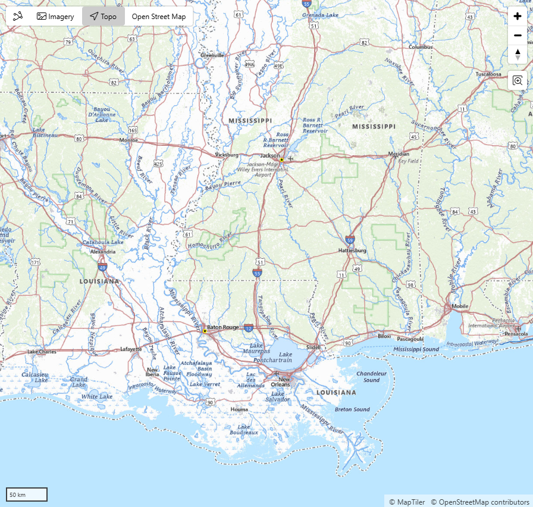
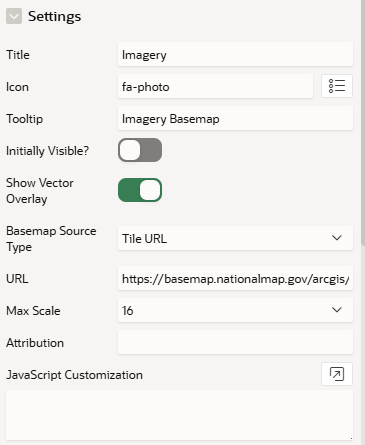

# Mapbits Basemap Tutorial

## Overview
The Mapbits Basemap Plug-In is a Page Item that displays a basemap switcher over an APEX native Map Region.

  
Figure 1

## Configuration
To add a basemap switcher to a map region, start by adding a Page Item to the region and changing its type to Mapbits Basemap. Then, set the title and (optionally) icon and tooltip.

The URL can be either a templated direct URL to the tile images or a TileJSON URL.

  
Figure 2

To add more basemap options, add more Mapbits Basemap page items.

### Tile URL
If you want to display a map from a WMS server, select this option. Add the following query parameters to the URL: `?bbox={bbox-epsg-3857}&format=image/png&service=WMS&version=1.1.1&request=GetMap&srs=EPSG:3857&transparent=true&width=256&height=256`.

If the basemap is served as "slippy map" tiles, you can use the `{z}`, `{x}`, and `{y}` substitutions. If you have map tiles in this format, the basemap provider probably has their URL already in the correct format.

You may need to adjust the Max Scale attribute if you choose this option. Zoom in on the map. If the basemap gets blurry too quickly, increase the Max Scale. If it disappears or becomes blank at some point, try decreasing it.

### TileJSON URL

If you are using Mapbox or a similar service, they will likely provide a TileJSON URL. Change "Basemap Source Type" to "TileJSON URL" and paste the URL.

When you choose this option, the "Max Scale" attribute disappears because the TileJSON specification includes this information.

### Access Keys

If the tile server you're using is not public, it likely requires an access key. It is bad coding practice to embed these keys directly in the page item attribute. They could leak if the application source code is ever shared, and they will be difficult to updated if the access key changes.

Instead, we recommend using a global Application Item to store the access key. It should be stored in a database table and queried in an Application Computation. Then, you can use a substitution in the URL, for example: `https://tileserver.example.com/tiles/{z}/{x}/{y}?access_key=G_BASEMAP_ACCESS_KEY.`.

### Initially Visible

Enable this switch to make this the default basemap.

### Show Vector Overlay

When enabled, place labels and street centerlines from APEX's default basemap are overlaid on the basemap. Enable this switch if the basemap doesn't have its own labels.

## Showing/Hiding Basemaps

In addition to the controls added to the map region, you can switch basemaps using Dynamic Actions or JavaScript. Use the standard Show/Hide DAs or `apex.item(X).show()`/`apex.item(X).hide()` item methods on the Basemap Page Item (where X is the Basemap Page Item name string). Hiding a layer switches back to the default basemap.

## Configuring the Default Basemap Button

The "default basemap" is the first button in the switcher, which returns the map to the basemap that APEX provides. You can configure the title, icon, and tooltip of this button by going to **Shared Components** -> **Component Settings** (under **Other Components**) -> **Mapbits Basemap [Plug-in]**.
