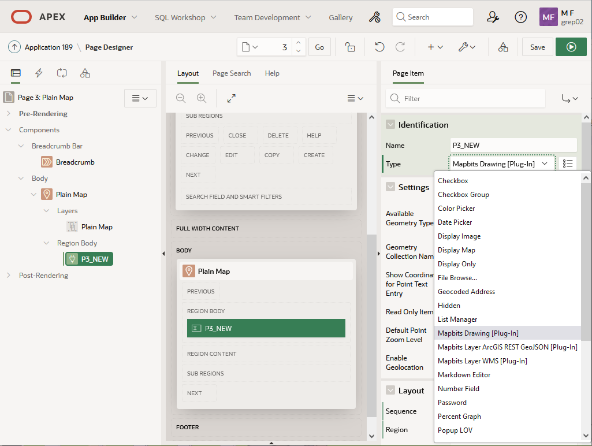
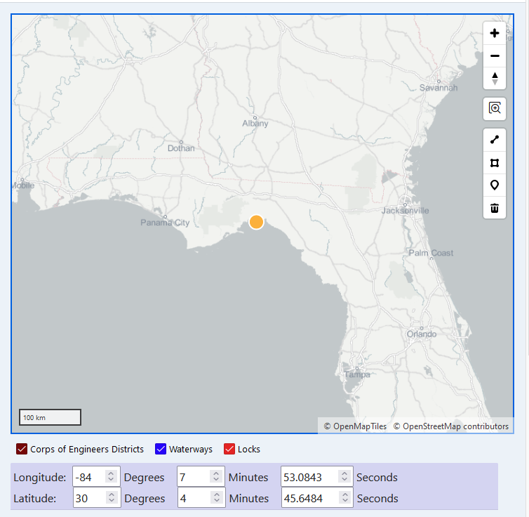

# Mapbits Drawing Tutorial
To add drawing functionality to a Map Region, you will first need to create a new page with a Map Region or add a Map Region to an existing page.
For more information on the Map Region itself, please consult Oracle's guide to [Creating Maps](https://docs.oracle.com/en/database/oracle/application-express/21.1/htmdb/creating-maps.html#GUID-ACA5ED1C-7031-42BF-90B1-98938FB6DC17
).

Once you have created a Map Region, create a Page Item in that Map Region and set the item's type to "Mapbits Drawing [Plug-In]" as shown in Figure 1. Notably, if you create a Mapbits Drawing page item and is not under a Map Region, you will see no effect.

Figure 1

At this point, you can run the page and confirm that your map region has the Drawing controls shown in Figure 2. This should consist of up to four buttons that appear below the Map Region's own control buttons.

Figure 2

You can click one of the buttons to turn on a drawing tool. There are different buttons for drawing points, lines, and polygons. Once you complete the drawing of a geometry, it will replace the previous geometry shown in the Map Region. The configurations options allow to pick which drawings tool to show, which is useful if you only want to draw one type of geometry.

