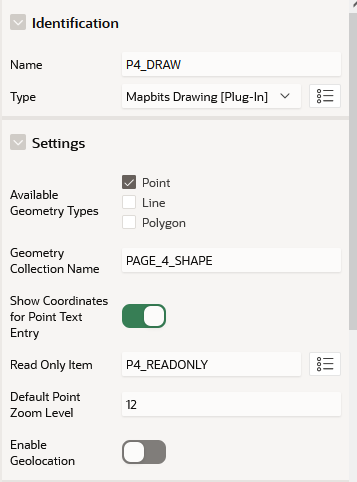

# Mapbits Drawing Tutorial
## Overview
The Mapbits Drawing Plug-in is a Page Item that adds point, line, and/or polygon drawing tools to the Application Express native Map Region. Geometry data in geojson format can be loaded into and saved from the Map Region using an APEX Collection. The intended usage pattern is to create the apex collection in a pre-rendering process and add the value of an existing geometry (if one exists) to that clob column of the collection in geojson format. Each time the geometry is edited in the Map, it is written back to the collection. A plsql process should be written to run on page submission to read from the collection and convert the geometry from a geojson clob to sdo_geometry, writing the geometry to the record begin processed by the page submission. 

## Adding Plugins
To add drawing functionality to a Map Region, you will first need to create a new page with a Map Region or add a Map Region to an existing page.
For more information on the Map Region itself, please consult Oracle's guide to [Creating Maps](https://docs.oracle.com/en/database/oracle/application-express/21.1/htmdb/creating-maps.html#GUID-ACA5ED1C-7031-42BF-90B1-98938FB6DC17
). You will also need to know how to import a Plug-in into your applications. For more information on that process, take a look at Oracles notes on [Importing Plug-ins](https://docs.oracle.com/en/database/oracle/application-express/21.2/htmdb/importing-export-files.html#GUID-C35440FD-FE8A-4799-A63F-2DB7D34087A2).

Once you have created a Map Region, create a Page Item in that Map Region and set the item's type to "Mapbits Drawing [Plug-In]" as shown in Figure 1. Notably, if you create a Mapbits Drawing page item and is not under a Map Region, you will see no effect.

Figure 1

At this point, you can run the page and confirm that your map region has the Drawing controls shown in Figure 2. This should consist of up to four buttons that appear below the Map Region's own control buttons.

Figure 2

You can click one of the buttons to turn on a drawing tool. There are different buttons for drawing points, lines, and polygons. Once you complete the drawing of a geometry, it will replace the previous geometry shown in the Map Region. The configurations options allow to pick which drawings tool to show, which is useful if you only want to draw one type of geometry.

## Editing Geometry Data
The Drawing Plug-in uses an [APEX Collection](https://docs.oracle.com/en/database/oracle/application-express/21.1/aeapi/APEX_COLLECTION.html) to persist geometry data in the CLOB001 column using geojson format. To edit geometries in your application, you will need to take three steps: 1) Set the collection name, 2) create a load process to loading existing geometry into the collection, 3) create a save process to write the geometry from the collection to its intended target.

First determine a name for the collection to be used to persist the geometry. Set the **Geometry Collection Name** to that name as shown in Figure 3. This example uses the name, PAGE_4_SHAPE. You will use this name in the PL/SQL for the next steps.

Figure 3

Next, create a new Process of **Type**, *Execute Code*, and **Execution Point**, *Before Header*. Using the language type of PL/SQL, code the process to create the collection and load it with geometry in geojson format.
Using the collection name PAGE_4_SHAPE from the previous step and an existing table, MB4_LOCKS, with a Page Item, P4_LOCK_ID, used for the primary key, you can load geometry from an existing record on a typical data entry 
with the following code:
~~~
declare
    cdata clob;
begin
    apex_collection.create_or_truncate_collection('PAGE_4_SHAPE');
    if :P4_LOCK_ID is not null then
        select sdo_util.to_geojson(shape) into cdata from mb4_locks where lock_id = :P4_LOCK_ID;
        apex_collection.add_member(p_collection_name => 'PAGE_4_SHAPE', p_clob001 => cdata);
    end if;
end;
~~~

Finally, create a Process at the **Point** *Processing* that is to be run on page submission that updates the geometry. Once again using the collection name PAGE_4_SHAPE and table MB4_LOCKS:
~~~
declare
    cdata clob;
begin
    select clob001 into cdata from apex_collections where collection_name = 'PAGE_4_SHAPE';
    update mb4_locks set shape = sdo_cs.transform(sdo_util.from_geojson(cdata), 8265) where lock_id = :P4_LOCK_ID;
end;
~~~

You can see this example in action by installing the Mapbits Demo Application into your own Application Express instance.
