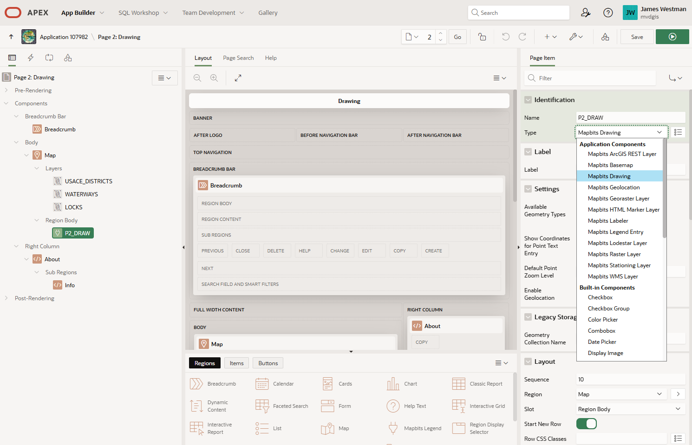
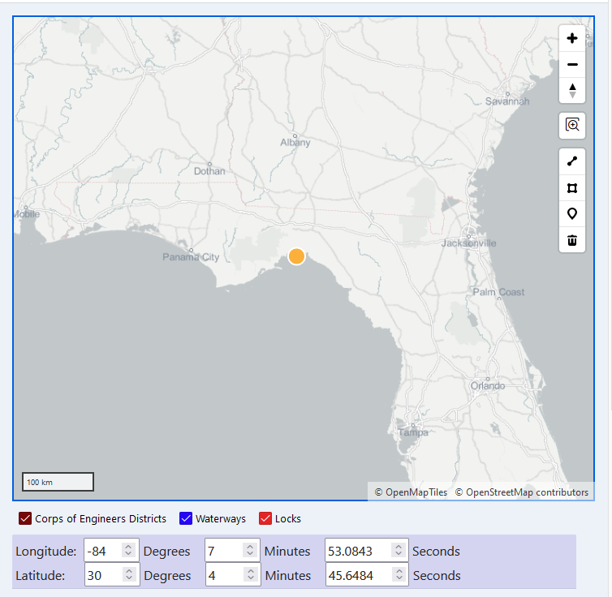
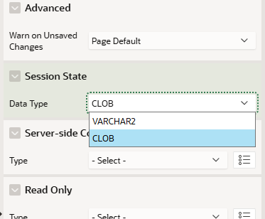

# Mapbits Drawing Tutorial

## Overview
The Mapbits Drawing Plug-in is a Page Item that adds point, line, and/or polygon drawing tools to the APEX native Map Region.

## Adding the Plugin
To add drawing functionality to a Map Region, you will first need to create a new page with a Map Region or add a Map Region to an existing page. For more information on the Map Region itself, please consult Oracle's guide to [Creating Maps](https://docs.oracle.com/en/database/oracle/apex/24.2/htmdb/creating-maps.html#GUID-ACA5ED1C-7031-42BF-90B1-98938FB6DC17). You will also need to know how to import a Plug-in into your applications. For more information on that process, take a look at Oracle's notes on [Importing Plug-ins](https://docs.oracle.com/en/database/oracle/apex/24.2/htmdb/importing-export-files.html#GUID-C35440FD-FE8A-4799-A63F-2DB7D34087A2).

Once you have created a Map Region, create a Page Item in that Map Region and set the item's type to "Mapbits Drawing [Plug-In]" as shown in Figure 1. Notably, if you create a Mapbits Drawing page item and it is not under a Map Region, you will see no effect.

  
Figure 1

At this point, you can run the page and confirm that your map region has the Drawing controls shown in Figure 2. This should consist of up to four buttons that appear below the Map Region's own control buttons.

  
Figure 2

You can click one of the buttons to turn on a drawing tool. There are different buttons for drawing points, lines, and polygons. Once you complete the drawing of a geometry, it will replace the previous geometry shown in the Map Region. The **Available Geometry Types** attribute allows you to pick which buttons to show, so you can control which geometry types users may enter.

## Editing Geometry Data

By default, the geometry is loaded and stored in the page item in GeoJSON format. To initialize the drawing plug-in with a shape from the database, use a Page Load process to convert the shape to GeoJSON using [`sdo_util.to_geojson`](https://docs.oracle.com/en/database/oracle/oracle-database/21/spatl/SDO_UTIL-reference.html#GUID-DB459897-729F-41D6-A2F3-DD39F22D8F63). To read the shape back into the database, use [`sdo_util.from_geojson`](https://docs.oracle.com/en/database/oracle/oracle-database/21/spatl/SDO_UTIL-reference.html#GUID-9D040DDE-64CD-4C98-B04B-11DA36D3A0D6).

Complex line or polygon geometries may not fit in the character limit for varchar2 fields. In this case, you will need to set the item's session state data type to CLOB instead, as shown in the figure below.

  
Figure 3

You can see this example in action by installing the Mapbits Demo Application into your own APEX instance.

> Note: There is also an option to store geometry in an APEX collection. This is included for compatibility with previous versions of Mapbits and is no longer recommended.

## Events

### Draw / Create

This event is emitted when a feature is added, changed, or deleted. You can use the JavaScript API to get the new geometry.

## JavaScript API

- **`setGeometry`**: Sets the geometry.

   Example:
    ```js
    apex.item('P2_ITEM_NAME').setGeometry(/* GeoJSON geometry object */)
    ```

- **`getGeometry`**: Gets the geometry as GeoJSON.

   Example:
    ```js
    const geometry = apex.item('P2_ITEM_NAME').getGeometry();
    /* geometry is a GeoJSON geometry object, or null if nothing has been drawn */
    ```

- **`async getMap()`**: Gets the MapLibre Map object. This is an async function because the map may not have loaded yet.

- **`getDraw()`**: Gets the plugin's MapboxDraw object, which is documented in the [mapbox-gl-draw documentation](https://github.com/mapbox/mapbox-gl-draw/blob/main/docs/API.md).

    This object is also available on the `draw` property of the MapLibre `Map` object, but this item method is the recommended way to access it.

    This function returns `null` within the **Initialization JavaScript Function**.

- **`setStyles()`**: Sets the styles for the drawing geometry. This is an array of MapLibre layers. See the [Styling Draw](https://github.com/mapbox/mapbox-gl-draw/blob/main/docs/API.md#styling-draw) section of the Mapbox Draw documentation.

    You can only call this method in the **Initialization JavaScript Function**. Once the drawing plugin is initialized, the styles should not be changed.

    ```js
    /* Initialization JavaScript Function */
    function(item) {
        const styles = item.getStyles();

        for (const layer of styles) {
            if (layer.id === 'gl-draw-point-static') {
                layer.paint['circle-radius'] = 5;
            }
        }

        item.setStyles(styles);
    }
    ```

- **`getStyles()`**: Gets the styles for the drawing geometry. This is a copy of the default style, unless `setStyles()` has been called. This is useful if you want to modify the default style in the **Initialization JavaScript Function**. Note, however, that the default style may be changed in future versions of Mapbits, so you may prefer to copy the style into your code and modify it there.