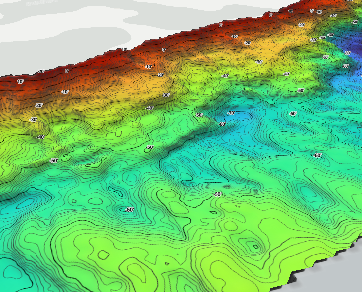
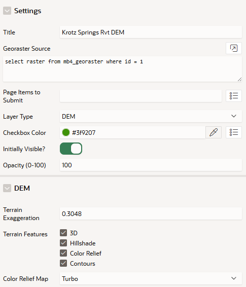

# GeoRaster Layer Tutorial

## Overview

The Mapbits GeoRaster Layer Plug-In is a page item that adds a raster layer using an Oracle GeoRaster table.



## Configuration

To add a GeoRaster Layer to an APEX map, create a page item in the map region and change its type to **Mapbits GeoRaster Layer**.  In the **GeoRaster Source** attribute, write a SQL query that returns a single row and column of type [`SDO_GeoRaster`](https://docs.oracle.com/en/database/oracle/oracle-database/26/geors/sdo_georaster-object-type.html).



### Layer Type
*(Automatic / Color / DEM)*
There are two ways to display the raster: as a color raster or a DEM (digital elevation model). The display can be explicitly chosen using the 'Color' or 'DEM' option. If 'Automatic' is selected (which is the default), Mapbits selects an appropriate choice based on the number and type of bands in the raster.

### Terrain Feature

If the **Layer Type** is 'DEM', a number of terrain-related options are available:

- **3D** enables a button on the right side of the map (under the zoom controls) to toggle 3D rendering of the DEM.

    

- **Hillshade** enables hillshading based on the DEM.
- **Color Relief** enables a customizable color relief layer produced by applying a color ramp to the DEM values. If 'Color Relief' is enabled, you can configure a built-in color ramp. Built-in color ramps are based on ['viridisLite'](https://github.com/sjmgarnier/viridisLite). If 'Custom' color ramp is selected, JavaScript can be used instead.

    Example custom color relief function:

    ```js
    function(stats) {
        return ['blue', 'white', 'red'];
    }
    ```
    
    Or, as an array of [value, color] pairs:

    ```js
    function(stats) {
        return [
            [stats.min, 'blue'],
            [(stats.min + stats.max) / 2, 'white'],
            [stats.max, 'red'],
        ]
    }  
    ```
    
    The **stats** argument also has mean, median, and stdev properties. Note that the statistics are approximated by sampling the raster data at intervals.
    
- **Contours** enables contour lines.

### Background Color

When the raster is reprojected onto MapLibre's tile grid, a tile may not be fully covered by the raster boundaries. What value should those "blank" pixels have? This background color is used, and is filtered out when the tile is displayed on the map. It should be a color that is not likely to be present in the real data. Alternatively, you can use 4-band rasters, which have an alpha channel that solves this problem.

If a background color is not specified for a 3-band color raster, areas outside the raster may appear black.

## Pyramids

Pyramids are critical for good performance. If your GeoRaster does not have pyramids, GeoRaster Layer will emit a warning to the console. See [Oracle's documentation](https://docs.oracle.com/en/database/oracle/oracle-database/26/geors/pyramids.html) for more information about generating pyramids.

## JavaScript API

Javascript methods can be invoked on plugin page item instances through the **apex.item** function. For example, calling `apex.item('P1_RASTER').show()` calls the show method on a GeoRaster plugin instance named P1_RASTER.

### Standard

- **`show()`**: Shows the layer.
- **`hide()`**: Hides the layer.
- **`refresh()`**: Reloads the source data.

### Other

- **`isVisible()`**: Returns a boolean indicating whether the layer is visible.
- **`toggleRasterLayer(visible)`**: Shows or hides the color layer. For color rasters, this is the layer itself, and for DEMs, it is the color relief layer. If `visible` is undefined, the visibility is toggled.
- **`toggleHillshadeLayer(visible)`**: Shows or hides the hillshade layer, if it is enabled in the configuration. If `visible` is undefined, the visibility is toggled.
- **`toggleContourLayer(visible)`**: Shows or hides the contour layer, if it is enabled in the configuration. If `visible` is undefined, the visibility is toggled.
- **`async queryPixel(lat, lon, z)`**: Queries the pixel value at the given coordinates. The `z` parameter indicates the zoom level to query at. If possible, already downloaded data is used, so this function is usually fast. However, it may take longer if the tile has not already been downloaded.
