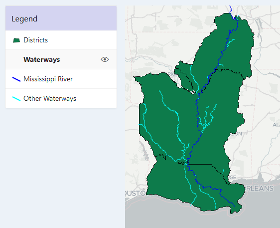
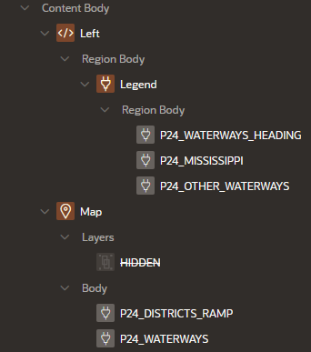
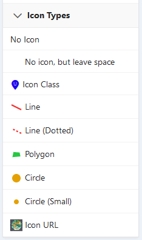
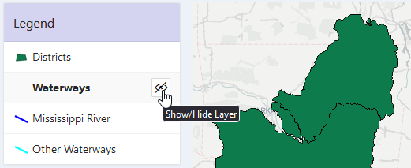
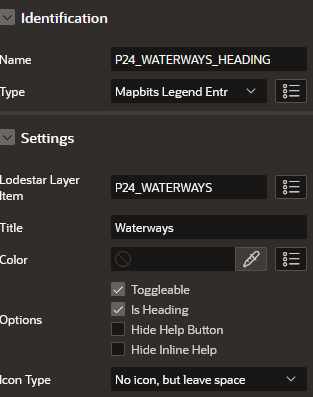
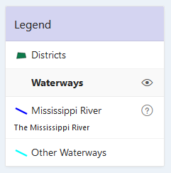
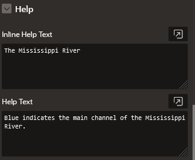

# Mapbits Legend Tutorial

## Overview

The Mapbits Legend region implements a map legend with symbology and flexible formatting.

## Adding a Legend

To add a legend to a map page, create a new region and set its type to Mapbits Legend.

If there is only one map region on the page, the legend will use it. If there are multiple regions, you must specify the particular map region to associate with the legend. To do this, go to the map region's Region tab, and under the Advanced section, give it a Static ID. Then, on legend's Attributes tab, enter the same Static ID in the Map Region text box.

Often, the legend should be to the side of the map, rather than above or below it. You can toggle off a region's "Start New Row" switch to make it appear to the right of the previous region.

You may want to select "Remove Body Padding" in the legend region's appearance options so the list view is flush against the region borders.

## Adding Legend Items

Any native Map Region layers will appear in the legend, as will Lodestar Layer items.

To change the appearance of a Lodestar Layer's legend entry, add a Legend Entry page item to the Legend region and set its "Lodestar Layer Item" to the page item. The Legend Entry's attributes now control the entry's appearance, though some settings default to the Lodestar Layer.

You can associate multiple Legend Entries with the same Lodestar Layer. Each one creates a separate row in the legend. This can be useful if you want to show multiple symbologies for a single Lodestar layer (for example, different colors or symbols).

You can also create a Legend Entry item that is not associated with a layer, but still has a title or symbology. This can be useful if you need to create headers or want to add some other additional information.

Figure 1 shows the items and regions for a page with a map and legend.

The order of Legend Entries is based on the items sequence numbers. If the Legend contains layers that do not have Legend Entries, the sequence number of the layer itself it used in the ordering.

### Icon Settings

If a Legend Entry item has an associated Lodestar Layer, then by default it will have the same appearance as if there was no Legend Entry item.

To change the icon, select an Icon Type. "No Icon" means there is no icon. "No icon, but leave space" leaves the icon blank, but still reserves the same amount of space so the text still lines up. "Icon Class" allows you to select a Font APEX icon. "Icon URL" allows you to enter a URL of an image, for example in your app's Static Application Files. "Line" and "Polygon" produce colored icons like for line and fill layers. This is useful if you have a line or fill implemented through Lodestar's "Custom" type.

You can set the color of the icon, if applicable, with the Color attribute.

Figure 2 shows all the icon types.

### Toggleable Entries

To make an entry toggleable, make sure it has a "Lodestar Layer Item" set, then check the "Toggleable" option. A button with an eye icon will appear on the right side of the row, which toggles the layer's visibility. Figure 3 shows a toggleable entry.

### Headers

To group multiple entries, create a new Legend Entry and check the "Is Header" checkbox. Figure 3 shows a header entry with two entries following it.

### Help Text

If a Lodestar Layer or Legend Entry has help text, it will be included in the entry, unless "Hide Help Button" or "Hide Inline Help" are checked. If both the Legend Entry and the associated Lodestar Layer have help text, the Legend Entry help text is used.

### Hiding Lodestar Layers from the legend

You can use a Legend Entry to hide a Lodestar Layer from the legend. Create the Legend Entry item, set its "Server-Side Condition" to "Never", and associate it with the Lodestar Layer.
