# Mapbits Lodestar Tutorial

## Overview

The Mapbits Lodestar Plug-in is a Page Item that adds an advanced map layer, with more access to
the MapLibre library than APEX's built-in map layers.

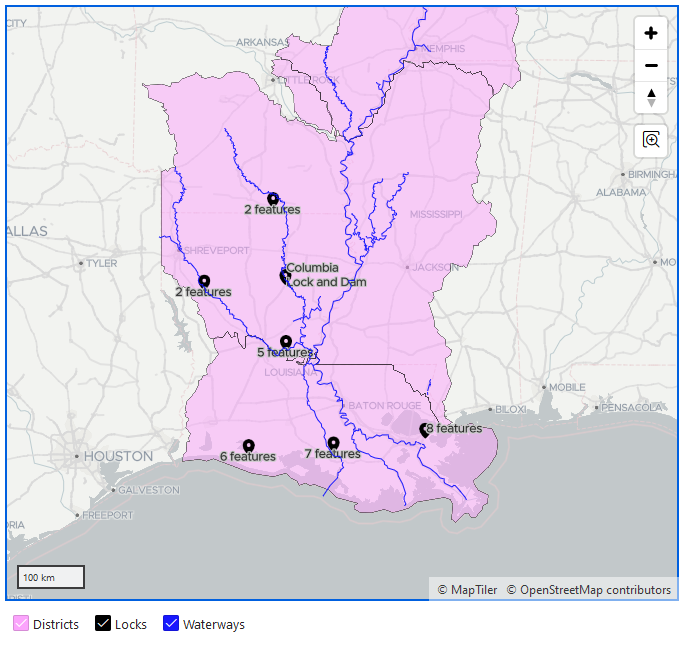

## Adding a Lodestar Layer

Lodestar layers are Page Items, so add a page item to your map region and select
"Mapbits Lodestar Layer [Plug-In]" as its type.

It is recommended to stick with one layer system in a map region--either use Lodestar for all map
layers, or APEX layers for all of them. APEX does not, as of 22.2, allow you to have a map region
with no layers. A good pattern for getting around this is to add a single built-in layer with
"Source / Type" as "SQL Query" and "Source / SQL Query" as `select cast(null as sdo_geometry) from dual where 1=0`,
as shown in Figure 1.

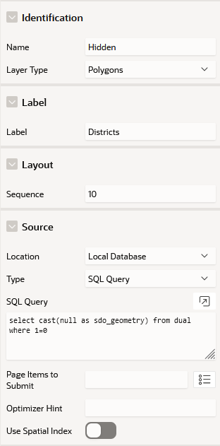  
Figure 1

## Configuring Your Layer

### Data Source

The two options for your data source are "SQL Query" and "Region Source". If "SQL Query" is specified, 
then you will be able to specify your data query in the lodestar layer page item's Source Query attribute. If 
"Region Source" is specified, the lodestar layer will use query source from its map region.
Regardless of your data source, you must have a geometry column at minimum,
which must be specified in the "Geometry Column" attribute. The ID column is optional. If specified,
it will populate the feature ID in the MapLibre data source, and it is also necessary for the
Mapbits Lodestar Select Features plug-in.

Any other columns present in the source will be sent to the browser as feature properties, which
can be accessed in styling expressions. **Keep in mind that feature property names are case-sensitive.**

### The Basic Option

The proper Layer Type depends on the geometry type of your query. Point features should use
"Symbol", lines should use "Line", and polygons should use "Fill". If you don't set the layer type
properly, your features may not appear on the map. If there are different geometry types in your
query, you may want to use a "Custom" layer type with multiple layers (more on custom layers below).
The settings for the three basic layer types are shown in Figure 2.

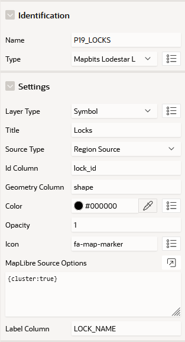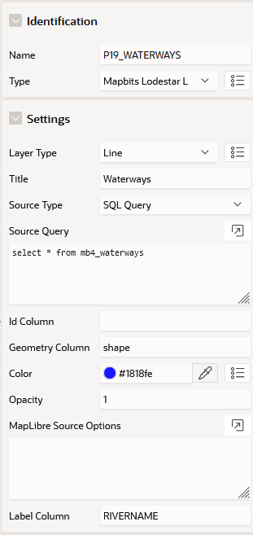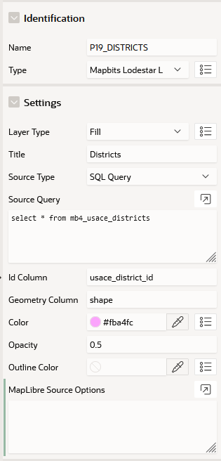  
Figure 2

You can set the opacity of the features in a layer with the Opacity attribute. Note that the
opacity applies to each feature individually, not to the layer as a whole. If features overlap,
the opacities stack like in Figure 3. Also, the opacity does not apply to the fill outline for Fill layers. That is
always opaque.

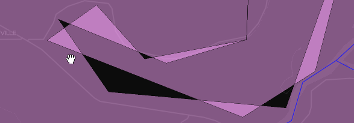  
Figure 3

Symbol and line layers can have a Label Column. This feature property will be used as the layer's
text. Like other feature properties, this name is case-sensitive.

### The Custom Option

The basic layer types are convenient, but to make use of the full power of Lodestar, you may opt
to set the Layer Type to Custom. Custom layers take raw MapLibre layer definitions, so while they
take more work to configure, they allow you to use almost any layer feature MapLibre provides.

MapLibre's documentation for layer definitions is here: <https://maplibre.org/maplibre-style-spec/layers/>.

The MapLibre Layer Definition attribute is a JavaScript expression. It can be:

- A layer definition
- An array of layer definitions
- A JavaScript function that returns a layer definition or array of layer definitions

The expression is evaluated inline on the page, but if you provide a function, it will not be
evaluated until after the map region is initialized.

In order to reduce the configuration work from specifying the layer from scratch, and to support
integration with other Mapbits features, Lodestar applies a number of defaults to your layers'
properties.

Font APEX icons may be used in the "icon-image" property. Just use the icon name, e.g.
"fa-map-marker", and Lodestar will add the icon to MapLibre for you the first time it is used.
Icons referenced this way are compatible with "icon-color" and "icon-halo-color".

Figure 4 combines many of these features in one example. It has both a line and symbol layer,
and the symbol layer uses the "fa-chevron-right" icon.

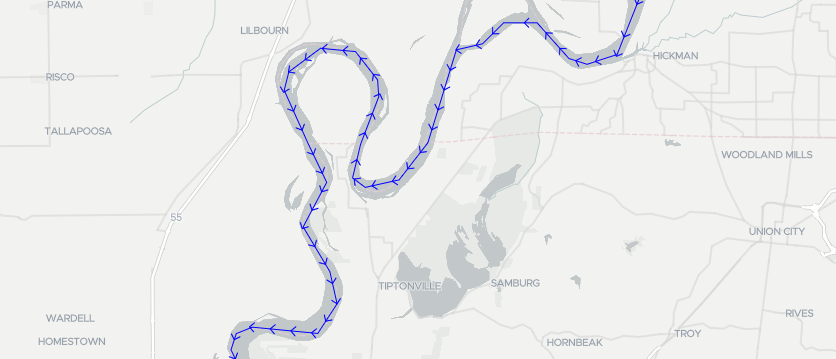 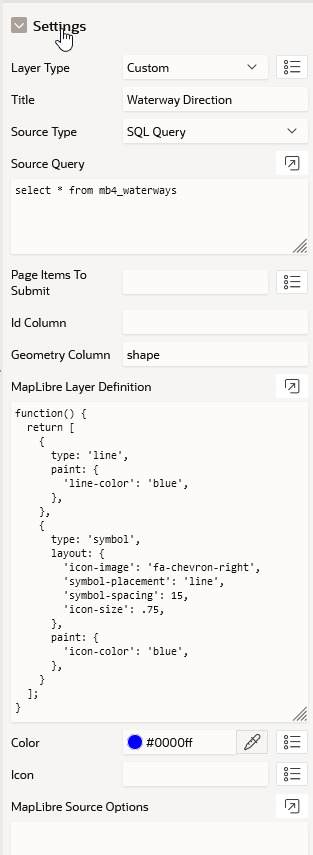  
Figure 4

### MapLibre Source Options

Whether you choose a basic or custom layer type, you can specify options for the source. This is
particularly useful for clustering points in symbol layers, which can be done by entering
`{cluster: true}` for this attribute. Other attributes control the way points are clustered.
Figure 4 shows the default appearance of clustered points.

Another option is `attribution`, which adds text to the attribution panel in the bottom-right when
the layer is visible, also shown in Figure 5.

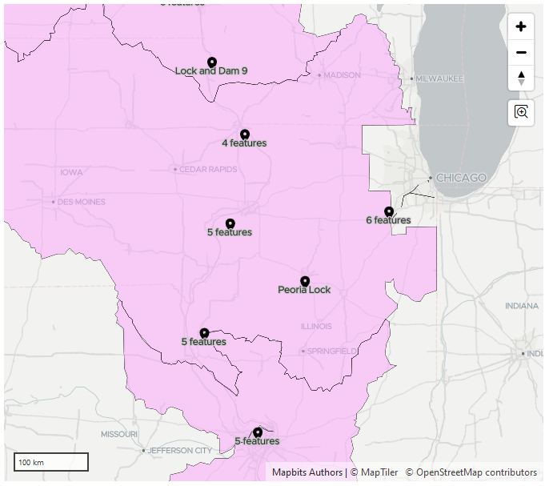 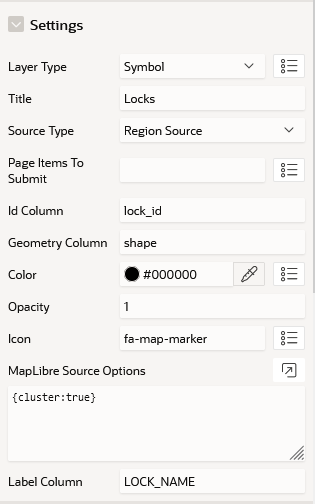  
Figure 5

MapLibre's documentation for source options is here: <https://maplibre.org/maplibre-style-spec/sources/#geojson>.
Do not try to use the `type` or `data` options, since those will be overridden by Lodestar.

### Handling Click Events

You can use Dynamic Actions to respond when a feature in a layer is clicked. Right-click the
Lodestar Layer page item and click "Create Dynamic Action". Set "When / Event" to "Component
Events / Feature Clicked [Mapbits Lodestar Layer]". If you attach an Execute JavaScript Code
action, then the JavaScript code can access the feature that was clicked using `this.data.feature`, which
is a [MapGeoJSONFeature](https://maplibre.org/maplibre-gl-js/docs/API/types/maplibregl.MapGeoJSONFeature/).
It has a "properties" field with the extra columns from the layer's query, an "id" field with
the ID column (if any), and references to other relevant MapLibre objects.

If a map layer has any Feature Clicked dynamic actions, then the cursor will change to a "pointer"
appearance when you hover over a feature in that layer.

## Selecting Features

The Mapbits Lodestar Select Features Plug-in is a Dynamic Action that selects or deselects features
in a Mapbits Lodestar Layer based on a query.

The Select Features DA has five modes, which are specified in the "Settings / Action" attribute:

- **Set Selection** sets the selection to the result of the query.
- **Add To Selection** adds the features from the query to the existing selection.
- **Remove From Selection** removes the features from the query from the existing selection.
- **Select All** selects all features and does not take a query.
- **Deselect All** deselects all features and does not take a query.

For the three modes that take a query, specify a SQL query that returns a single column: the IDs
of the features you want to select or deselect. These must match the IDs in the "ID Column"
of the Lodestar Layer.

Figure 6 shows the dynamic action used to highlight locks in a particular district.

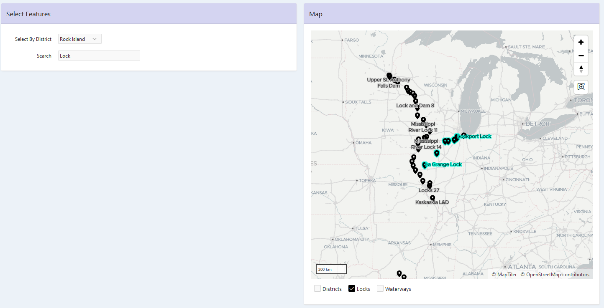  
Figure 6


### Selections and Custom Layers

If your Lodestar Layer's type is Custom, you should be aware of how Mapbits implements the "selected"
appearance.

Lodestar sets the "mapbits-selected" boolean property on every feature. If point clustering is
enabled, then a cluster's "mapbits-selected" is true if any point in the cluster is selected.

For symbol layers, Lodestar uses the "icon-halo-width", "icon-halo-color", and "text-halo-color"
properties. If you don't override them, your layer should work fine. If you do, you should use
an expression to take the selected state into account. For example, this is the default
"text-halo-color" expression:

```javascript
"text-halo-color": [
  "case",
  ["==", ["get", "mapbits-selected"], true],
  "#05fadd", // selected color
  "#ccc"     // regular color
]
```

Line and Fill layers are more involved because selections are implemented using a separate layer.
(In MapLibre, it is a very common pattern to use multiple style layers with a single source layer
in order to achieve certain effects). For line layers, the "highlight" layer is behind the main
layer and slightly thicker. For fill layers, the "highlight" is a line layer above the main fill
layer. In both cases, the highlight layer uses a filter expression like this:

```javascript
"filter": ["==", ["get", "mapbits-selected"], true]
```

Lodestar won't add this selection highlight layer for you if you choose a custom layer type. You
will need to add it yourself. Remember that the MapLibre Layer Definition attribute accepts arrays,
so one **Lodestar Layer item** can contain multiple **MapLibre layers** which will act as one group.
