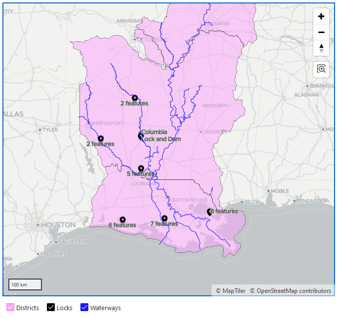
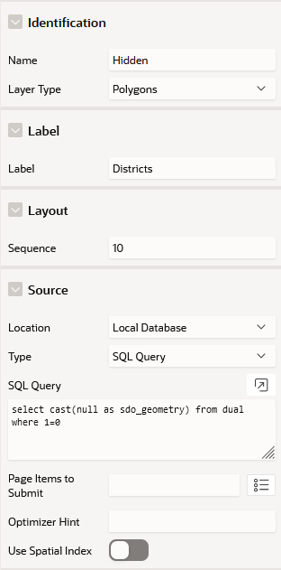
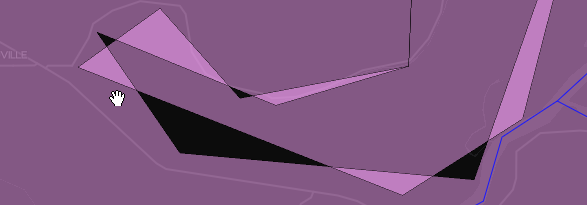
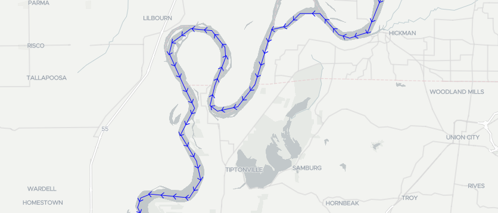
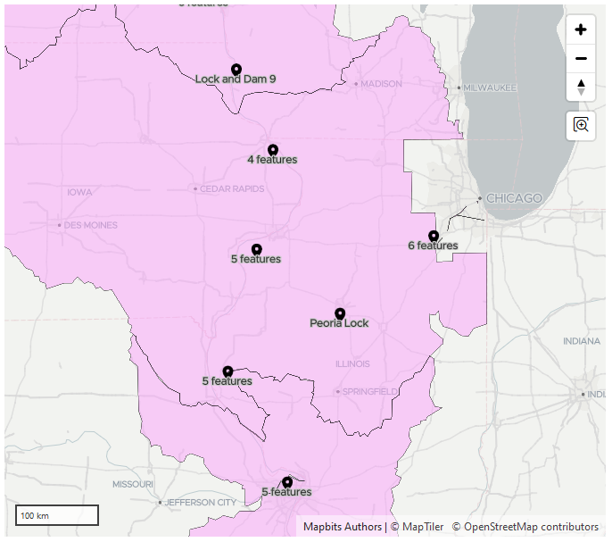
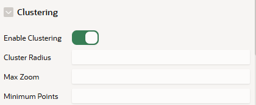
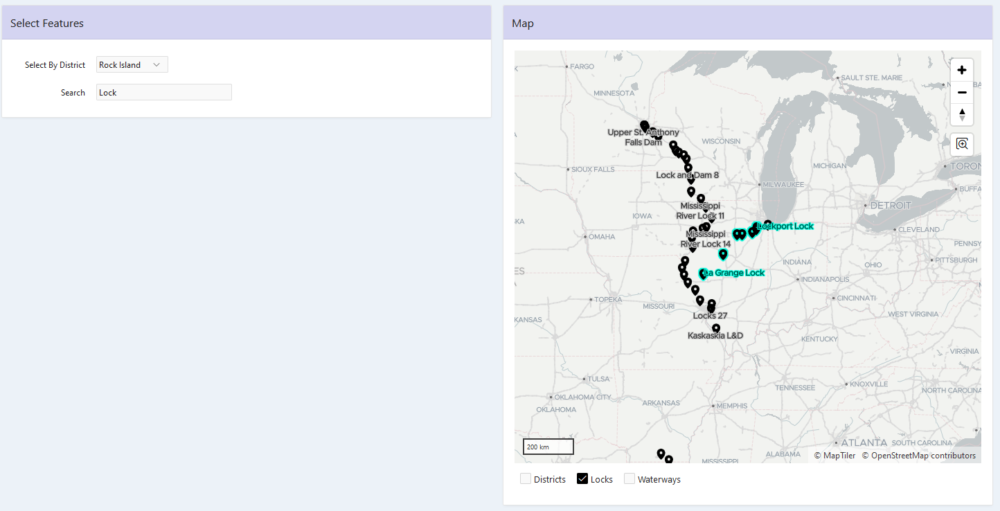

# Mapbits Lodestar Tutorial

## Overview

The Mapbits Lodestar Plug-in is a Page Item that adds an advanced map layer, with more access to
the MapLibre library and its features than APEX's built-in map layers.



## Adding a Lodestar Layer

Lodestar layers are Page Items, so add a page item to your map region and select "Mapbits Lodestar Layer" as its type.

It is recommended to stick with one layer system in a map region--either use Lodestar for all map layers, or APEX layers for all of them. APEX does not, as of 24.2, allow you to have a map region with no layers. A good pattern for getting around this is to add a single built-in layer with "Source / Type" as "SQL Query" and "Source / SQL Query" as `select cast(null as sdo_geometry) from dual where 1=0`, as shown in Figure 1.

  
Figure 1

## Configuring Your Layer

### Data Source

The three options for your data source are **SQL Query**, **Region Source**, and **JavaScript**. If **SQL Query** is chosen, then you will be able to specify your data query in the lodestar layer page item's Source Query attribute. If **Region Source** is chosen, the lodestar layer will use the query source from its map region. The **JavaScript** option is discussed in the "JavaScript Data Source" section. Except for JavaScript sources, you must have a geometry column at minimum, which must be specified in the **Geometry Column** attribute. The **ID Column** is optional. If specified, it will populate the feature ID in the MapLibre data source, and it is also necessary for the Mapbits Lodestar Select Features plug-in.

Any other columns present in the source will be sent to the browser as feature properties, which can be accessed in styling expressions. **Keep in mind that feature property names are case-sensitive.**

#### Facet Search

To use APEX's Facet Search feature with Lodestar layers, use **Region Source** as the layer source. If you create multiple layers with this source, they will all be filtered by the facets. One common pattern is to have both a polygon and a point symbol for each record to make the map useful at high and low scales. You can achieve this by creating two Lodestar layers, one with a Fill style, and the other with a Symbol style and **Convert to Point** enabled. For even more flexibility, you can have multiple `SDO_GEOMETRY` columns in your region source query and use a different one in each layer, and you can filter each layer independently using the **Where Clause** attribute.

### The Basic Option

The proper Layer Type depends on the geometry type of your query. Generally, point features should use **Symbol**, lines should use **Line**, and polygons should use **Fill**. If you don't set the layer type properly, your features may not appear on the map. If there are different geometry types in your query, you may want to use a **Custom** layer type with multiple layers (more on custom layers below).

You can set the opacity of the features in a layer with the **Opacity** attribute. Note that the opacity applies to each feature individually, not to the layer as a whole. If features overlap, the opacities stack like in Figure 2. Also, the opacity does not apply to the fill outline for Fill layers. That is always opaque.

  
Figure 2

In addition, there are **Circle** and **Heatmap** layer types for use with point geometries. Circle shows a circle for each point with a configurable radius, and Heatmap shows the density of points.

Symbol, line, and circle layers can have a **Label Column**. This feature property will be used as text to label the features. Like other feature properties, this name is case-sensitive.

### The Custom Option

The basic layer types are convenient, but to make use of the full power of Lodestar, you may opt
to set the **Layer Type** to **Custom**. Custom layers take raw MapLibre layer definitions, so while they
take more work to configure, they allow you to use almost any layer feature MapLibre provides.

MapLibre's documentation for layer definitions is here: <https://maplibre.org/maplibre-style-spec/layers/>.

The **MapLibre Layer Definition** attribute is a JavaScript expression. It can be:

- A layer definition
- An array of layer definitions
- A JavaScript function that returns a layer definition or array of layer definitions

The expression is evaluated inline on the page, but if you provide a function, it will not be evaluated until after the map region is initialized.

In order to reduce the configuration work from specifying the layer from scratch, and to support integration with other Mapbits features, Lodestar applies a number of defaults to your layers' properties.

Font APEX icons may be used in the "icon-image" property. Just use the icon name, e.g. "fa-map-marker", and Lodestar will add the icon to MapLibre for you the first time it is used. Icons referenced this way are compatible with "icon-color" and "icon-halo-color". The "icon-image" can also be a path to a PNG image in a static application file, e.g. `#APP_FILES#my-icon.png`.

Figure 3 combines many of these features in one example. It has both a line and symbol layer,
and the symbol layer uses the "fa-chevron-right" icon.

  
Figure 3

Here is the **MapLibre Layer Definition** code used in Figure 3. It creates a blue line layer and a symbol layer that uses a Font APEX icon to draw arrows along the length of the line.

```js
function() {
  return [
    {
      type: 'line',
      paint: {
        'line-color': 'blue',
      },
    },
    {
      type: 'symbol',
      layout: {
        'icon-image': 'fa-chevron-right',
        'symbol-placement': 'line',
        'symbol-spacing': 15,
        'icon-size': .75,
      },
      paint: {
        'icon-color': 'blue',
      },
    }
  ];
}
```

#### Sharing Styles Across Pages

If you have multiple maps in an application with the same or similar styling on different pages, one option to keep your styles maintainable is to use custom functions defined in an application-wide JavaScript file.

Go to **Shared Components** -> **Static Application Files** (under **Files and Reports**), then click **Create File**. Give it a name, such as `map-styles.js`. Define your custom style functions there.  Go to **Shared Components** -> **User Interface Attributes** (under **User Interface**). Go to the **JavaScript** section. Paste the name of the new JavaScript file in the **File URLs** text box, e.g. `#APP_FILES#map-styles.js`. In each Lodestar Layer's **MapLibre Layer Definition** attribute, paste the name of the style function you want to use for that layer.

### Clustering

When many features--particularly point features--are close together, the map can be very difficult to read. To make it easier to see an overview of the points in an area, you can enable clustering. This combines multiple nearby points into a single point. When you zoom in, the cluster "splits" into smaller clusters until the points are visually distinct enough to show individually.

Clustered points have the same style as individual points, but if labelling is enabled, then clusters use the label "{n} features" instead of the label column.

Keep in mind that most feature properties are not available in cluster points, since the cluster represents multiple points that might have different values.

   
Figure 4

### MapLibre Source Options

Whether you choose a basic or custom layer type, you can specify options for the source using the **MapLibre Source Options** attribute. For example, you can set the `attribution` field, which adds text to the attribution panel in the bottom-right when the layer is visible.

MapLibre's documentation for source options is here: <https://maplibre.org/maplibre-style-spec/sources/#geojson>. Mapbits uses the `geojson` source type internally. Keep in mind that some of the options described in the MapLibre documentation may be overridden by Lodestar, or may interfere with its operation.

The JavaScript code here may evaluate to the options object itself, or to a (possibly async)
function that returns the options object.

### JavaScript Data Source

Usually, geographic data is queried on the server and sent to the client. In some cases, though, even more flexibility is required. In this case, you can set your data source type to "JavaScript" and provide raw GeoJSON using client-side code. This is useful if:

- You need to use PL/SQL to generate the GeoJSON
- The data requires further processing that's easier to do in JavaScript than in a SQL query
- You are storing data in localStorage or IndexedDB for offline use
- You have a static GeoJSON blob to display

By setting the data source type to "JavaScript", you are responsible for providing the `data` option from the **MapLibre Source Options** code. The data should be a GeoJSON FeatureCollection. Remember, this code can be a function. If that is the case, it will be re-run whenever the item is refreshed. The function can be async.

### An Important Note about Feature IDs

The ID column may be a number, date, timestamp, varchar2, or clob, but MapLibre only allows positive integer feature IDs. Therefore, Mapbits assigns new feature IDs when it passes the data to MapLibre. Mapbits APIs handle this transparently, but if you get a feature directly from MapLibre (e.g. by connecting an event handler to the Map object), you will need to call the item's **`convertID(id)`** method to get the original ID.

## Info Windows

Info windows are popups that appear when you hover over or click a feature. You can enable them by setting the **Info Window** / **Behavior** attribute. The values are:

- **No Info Window**: There is no info window.
- **On Hover & Click**: This is the most common option. The popup appears when you hover over the feature, and you can click to make it stay when you move the cursor away.
- **On Click**: The popup appears when you click a feature.
- **On Hover**: The popup appears while the cursor is over a feature.
- **Separate Hover & Click**: Like **On Hover & Click**, but there is a separate HTML template for the popup that appears when you click.

When info windows are enabled, use the **HTML Expression** attribute to control the contents of the window. The syntax is described in [Oracle's documentation](https://docs.oracle.com/en/database/oracle/apex/24.2/htmdb/using-template-directives.html). You can use substitution variables that reference columns in the source data, e.g. `&MY_COLUMN.`. The expression can contain any HTML, including links, buttons, and tables.

If there are multiple features under the cursor, even in different layers, all of their info window content is shown in one popup.

## Selecting Features

### By User Interaction

There are two ways users can select features on the map itself, if the developer enables them: clicking and rectangle select. These can be enabled with the switches in the **Selection** attribute section.

If **Click to Select** is enabled, you can also enable **Multi-Select**. With multi-select, you can hold <kbd>Control</kbd> while clicking a feature to add it to the selection. If you also specify an **Order By Column**, you can hold <kbd>Shift</kbd> while clicking a feature to add a range to the selection. This is useful, for example, if you have many points along a line and want to be able to select a range of them.

If **Rectangle Select** is enabled, a button appears on the right side of the map under the standard map controls. Click this button, then click and drag to draw a rectangle on the map. All features that intersect the rectangle are selected.

### By Dynamic Action

The Mapbits Lodestar Select Features Plug-in is a Dynamic Action that selects or deselects features in a Mapbits Lodestar Layer based on a query.

The Select Features DA has five modes, which are specified in the **Settings** / **Action** attribute:

- **Set Selection** sets the selection to the result of the query.
- **Add To Selection** adds the features from the query to the existing selection.
- **Remove From Selection** removes the features from the query from the existing selection.
- **Select All** selects all features and does not take a query.
- **Deselect All** deselects all features and does not take a query.

For the three modes that take a query, specify a SQL query that returns a single column: the IDs of the features you want to select or deselect. These must match the IDs in the **ID Column** of the Lodestar Layer.

Figure 5 shows the dynamic action used to highlight locks in a particular district.

  
Figure 5

### Using JavaScript

The Lodestar item API has functions for changing the selection. See the **Javascript API** section below.

#### Example

```js
apex.item('P2_MY_LODESTAR_LAYER').setSelectedFeatures([11, 34, 55], 'set');
```

### Custom Selection Styling

By default, the selection is displayed using separate style layers that are filtered to only the selected features. This is the most performant way, since it only involves filtering the data set, not changing it. You can change the color of the selection layers using the **Selection Color** attribute. For more control, you can change some of the style properties of these layers with a bit of JavaScript  in the **Initialization JavaScript Function** attribute:

```js
function(item) {
  item.setSelectionStyle({
    'line-width': 3,
  });
}
```

However, some custom selection effects require changing the primary style layers. For example, you might want selected features to have a different text or icon halo color. To handle this case, you need a bit of JavaScript in the **Initialization JavaScript Function** attribute:

```js
function(item) {
  item.setSelectionStyle('property');
}
```

This disables the selection layers and causes Lodestar to set the "mapbits-selected" boolean property on every feature. If clustering is enabled, then a cluster's "mapbits-selected" is true if any point in the cluster is selected. Then you can use style expressions to change the layer style when the feature is selected, like so:

```javascript
"text-halo-color": [
  "case",
  ["==", ["get", "mapbits-selected"], true],
  "#05fadd", // selected color
  "#ccc"     // regular color
]
```

The default styles that Mapbits applies also use expressions like these.

## Events

These events can be used by right-clicking the Lodestar Layer page item, clicking **Create Dynamic Action**, and changing **When** / **Event** to one of the values below. (Be sure that you pick the ones that end in "[Mapbits HTML Marker Layer]". Other Mapbits layers have events with the same names that will appear in the dropdown.)

### Feature Clicked

This event is emitted when a feature in the layer is clicked.

If you attach an Execute JavaScript Code action, then the JavaScript code can access the feature that was clicked using `this.data.feature`, which is a [MapGeoJSONFeature](https://maplibre.org/maplibre-gl-js/docs/API/types/maplibregl.MapGeoJSONFeature/). It has a `properties` field with the extra columns from the layer's query, an `id` field with the ID column (if any), and references to other relevant MapLibre objects.

The JavaScript code also has a `this.data.isTopmostLayer` property. This is `true` if the feature is the topmost thing that was clicked, or `false` if there is another feature rendered above it at the clicked point. This can be used to filter out duplicate events if there are overlapping features.

If a map layer has any Feature Clicked dynamic actions, then the cursor will change to a "pointer" appearance when you hover over a feature in that layer.

### Loading Started

This event is emitted whenever the layer begins loading data, including when it is refreshed. It can be used to show a loading indicator.

### Loading Finished

This event is emitted whenever the layer finishes loading data. It can be used to hide a loading indicator.

### Visibility Toggled

This event is emitted when the layer is made visible or invisible through the legend, dynamic actions, or the JavaScript `show`/`hide` methods.

## JavaScript API

Lodestar Layer items have a JavaScript API that enable additional features. These methods can be accessed from the `apex.item('P1_ITEM_NAME')` object.

### Standard

These functions follow the standard APEX JavaScript interface.

- **`show()`**: Shows the layer.
- **`hide()`**: Hides the layer.
- **`async refresh()`**: Reloads the source data.

### General

- **`async waitForLoad()`**: Returns a Promise that resolves when the layer has loaded.
- **`isVisible()`**: Returns a boolean indicating whether the layer is currently visible.
- **`getSourceData()`**: Gets the layer data as retrieved from the source (not including edits).
- **`getSourceName()`**: Gets the ID of the source that was added to the MapLibre `Map` object.
- **`getLayerIDs()`**: Gets an array of the style layer IDs that were added to the map by this Lodestar Layer.
- **`async getMap()`**: Gets the MapLibre `Map` object for the layer's associated region. The map may not have loaded yet, so this function returns a Promise.
- **`convertID(id)`**: Internally, Mapbits passes sequential IDs to MapLibre instead of the IDs in the source data. This is because MapLibre only supports positive integer IDs, but GeoJSON also supports strings. Mapbits APIs return the original source IDs, but if you get a feature ID directly from MapLibre (e.g. with queryRenderedFeatures), then you need to use this function to get the source ID.
- **`hasIDColumn()`**: Returns a boolean indicating whether the ID Column attribute is set.
- **`zoomToFeature(featureId, opts)`**: Zooms the map to show the given feature. The `featureId` parameter is the ID of the feature to zoom to, and `opts` is a [FitBoundsOptions](https://maplibre.org/maplibre-gl-js/docs/API/type-aliases/FitBoundsOptions/) object.

### Selection

- **`getSelectedFeatures()`**: Gets the IDs of the selected features.
- **`setSelectedFeatures(features, action)`**: Changes the selection set. `features` is a list of feature IDs and `action` is one of `'set'`, `'add'`, `'remove'`, or `'toggle'`.
- **`selectAllFeatures()`**: Selects all features in the layer.
- **`clearSelection()`**: Clears the selection.
- **`setSelectionStyle(opts)`**: Sets the selection style options. This must be called within the **Initialization JavaScript Function**. The argument may either be the string `'property'` to use the property-based selection style, or it may be an object with style properties to apply to the selection layers.

### Editing

For more advanced data entry scenarios, Lodestar offers an editing API through JavaScript. Using this API, you can make changes to the data on the client side, then upload them to an application process (or elsewhere).

- **`editFeature(action, feature)`**: Edits a feature. `action` should be `'create'`, `'update'`, or `'delete'`. `feature` is the feature to edit. If the action is `'delete'`, then `feature` only needs the `id` property.
  
  If `action` is `'create'` and the feature has no ID, a UUID will be assigned as the ID.

- **`getEdits()`**: Gets the list of edits that have been made to the layer. This is the function you will likely use when saving changes via page process.

  Only the latest edit for each feature is included. For example, if a feature is edited and then deleted, only the delete edit is returned. If a feature is created and then deleted, no edit is returned for it.

  Edit objects have the following fields:

  - **`action`**: `'create'`, `'update'`, or `'delete'`
  - **`feature`**: The edited feature as GeoJSON

- **`isChanged()`**: Returns a boolean indicating whether any edits have been made.
- **`getEditedData()`**: Gets the full data of the layer with edits applied.
- **`getFeature(id)`**: Gets the feature with the given ID, with edits applied. If the feature has been deleted, returns `undefined`.
- **`getFeatureEditAction(id)`**: Gets the edit action (`'create'`, `'update'`, `'delete'`, or `'none'`) for the given feature.
- **`clearEdits()`**: Clears the edits from the layer.
- **`clearEditsAndRefresh()`**: Clears edits from the layer, then refreshes the data source.
